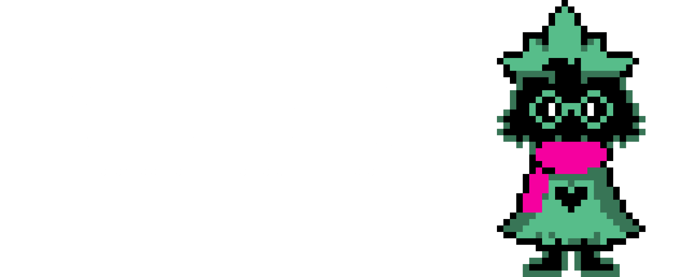

<div align="center">

# Noa
<p>
Full Stack developer crafting weird systems with TypeScript, Ruby and energy drinks.
</p>

<p>

</p>

</div>

```ts
const noa = {
  role: "Full Stack Developer",
  focus: "Backend-first Architecture",
  
  languages: [
    "TypeScript",
    "JavaScript",
    "Ruby"
  ],

  frontend: [
    "React",
    "React Router",
    "Tailwind"
  ],

  backend: [
    "Node.js",
    "NestJS",
    "ElysiaJS",
    "Express"
  ],

  passions: [
    "APIs",
    "Discord Bots",
    "Open Source",
    "Linux",
    "Chaotic Ideas"
  ]
}
```

---

# About

```yaml
name: Noa

role:
  - Full Stack Developer
  - Backend-first Engineer

main_stack:
  backend:
    - Node.js
    - NestJS
    - ElysiaJS
    - Ruby

  frontend:
    - React
    - ReactRouter
    - TailwindCSS

database:
  - PostgreSQL
  - MongoDB
  - SQLite

currently_doing:
  - Building bots
  - Creating APIs
  - Designing scalable (or not) systems
  - Breaking production accidentally
```

---

# Featured Projects

## :robot: Koxik Bot
Koxik is a simple yet powerful Discord bot designed to cover the essentials without unnecessary complexity. 
> [Website](https://koxik.ozorg.xyz/) | [Top.gg](https://top.gg/bot/1446227976793493594)  | [Github](https://github.com/OZ-Org/Koxik) | [X](https://x.com/koxikbot)

## Hey, there's nothing else!
Honestly, Koxik is my project that I like the most. There's nothing else to talk about.

---

# Tech Stack

<div align="center">

## Backend


## Frontend


## Database


## DevOps & System


</div>

---

# Stats

<div align="center">


</div>

---

# Activity

<div align="center">

[](https://discord.com/users/878732372626006127)

</div>

---

# Contact

<div align="center">

[](https://discord.com/users/878732372626006127)
<br>
Email: noa.simoesss@gmail.com

</div>

---

<div align="center">

> probably debugging something right now


</div>
